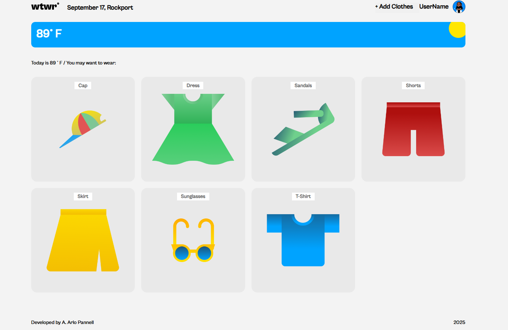
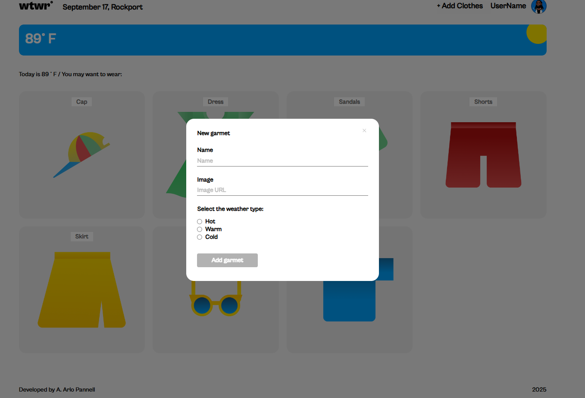
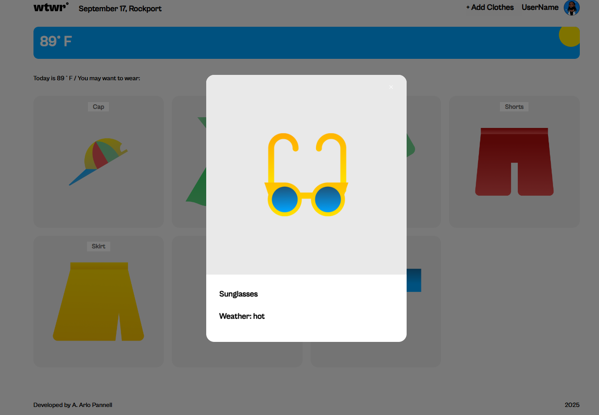

# Project 5: What 2 Wear - Weather App

## Overview

- Project Description
- Methods / Tools
- Git Hub
- Screenshots

### Project Description

This is the final project for the Software Engineering boot camp, and will be the vehicle to practice full stack development skills

- Create the entire site using React.js / Vite
- Follow design requirements included in the Figma specifications.
- Utilize Git Hub for version control, file management, and deployment.
- Create a dynamic layout, one that adapts to screen sizes and devices as described in the design document.
- Practice documentation skills, including creation and development of this file.
- Leverage Open Weather API to get current weather data.
- Store user data in an online database

### Methods / Tools

- The design requirements are in Figma--
  https://www.figma.com/design/F03bTb81Pw8IDPj5Y9rc5i/Sprint-10-Project--WTWR?node-id=311-433&p=f&t=WtyJpz0nQAKcgilk-0

- React.js components make up the entire site, HTML is rendered dynamically

- Screenshots of the page are included in this file, images stored in the images folder.

### Git Hub

Project is version controlled and deployed to Git Hub -

https://github.com/ArloPannell/se_project_react

### Project Explanation Video

A short video will be available once the project is complete

### Screenshots

Main view -- temperature information, location, and weather card are dynamic based on location data from API

Form to add a new clothing item

Preview of what an item, pop up displays when card is clicked

